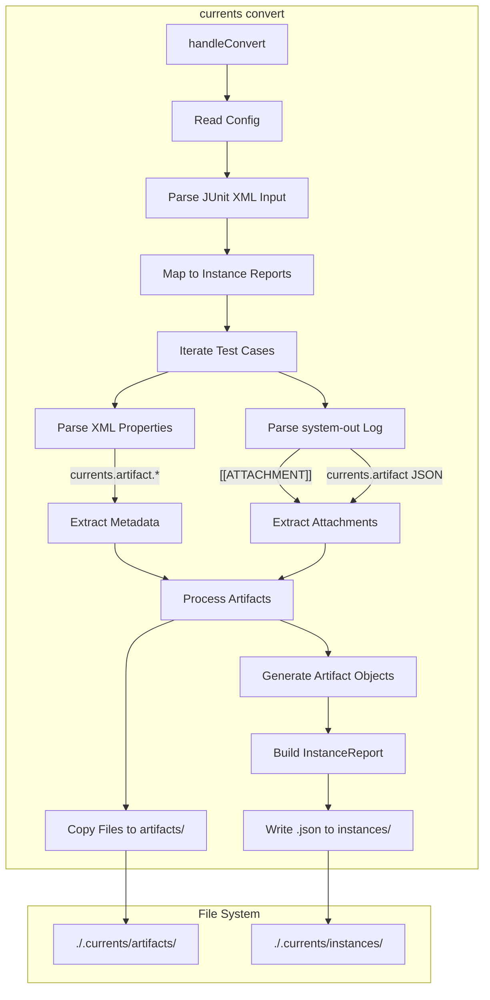

# Artifacts Guide

This document is a comprehensive guide on how to generate and manage artifacts using `@currents/jest` and the `@currents/cmd` CLI. It covers both the **User Guide** (how to use it) and the **Internal Workflow** (how it works under the hood).

---

# Part 1: User Guide

## A. Using `@currents/jest` Reporter

The `@currents/jest` reporter allows you to attach screenshots, videos, and other files directly from your Jest tests. These artifacts will be uploaded to the Currents dashboard and associated with the specific test execution.

### 1. Installation

```bash
npm install @currents/jest --save-dev
```

### 2. Configuration

Add `@currents/jest` to your `jest.config.js`:

```javascript
// jest.config.js
module.exports = {
  reporters: [
    'default', // Keep the default reporter for console output
    '@currents/jest'
  ],
  // ... other config
};
```

### 3. Attaching Artifacts in Tests

You can use the `attachArtifact` helper (and others) to attach files. You can attach artifacts at three levels:
*   **Attempt (Default)**: Attached to the specific retry of a test.
*   **Test**: Attached to the test case (visible across all retries).
*   **Spec**: Attached to the test file (suite) itself.

#### Example

```typescript
import { attachArtifact } from '@currents/jest';
import * as path from 'path';

describe('My Feature', () => {
  it('should upload artifacts on failure', async () => {
    try {
      // Your test logic...
      await someAction();
    } catch (error) {
      // Take a screenshot
      const screenshotPath = path.resolve(__dirname, 'screenshots/failure.png');
      await takeScreenshot(screenshotPath); // Your custom helper
      
      // Attach the screenshot (Attempt Level by default)
      attachArtifact(screenshotPath, 'failure-screenshot.png');
      
      throw error;
    }
  });

  it('should upload test-level metadata', () => {
    // Attach a log file relevant to the whole test case, regardless of retries
    attachArtifact('logs/test-metadata.json', 'metadata', 'test');
  });
});
```

### 4. Running Tests

Run your tests as usual. The artifacts will be collected automatically.

```bash
npm test
```

When you run `currents upload` (or if you use `currents run`), these artifacts will be discovered in the `.currents/` directory and uploaded.

---

## B. Using `currents convert`

If you are using a different test runner (like JUnit, Mocha, etc.) and generating XML reports, you can use `currents convert` to transform them into a format Currents understands. You can embed artifact information in two ways.

### Method 1: XML Properties (Structured)

You can add `<property>` tags to your JUnit XML to explicitly define artifacts.

> **Note on Implementation:** Most standard JUnit reporters (like the default ones in Jest or Vitest) do not automatically include custom properties for artifacts.
> 
> To use this method, you typically need to:
> 1.  Use a test runner that supports custom XML property injection via its configuration or API.
> 2.  Write a small custom reporter wrapper that extends the standard JUnit reporter to inject these properties based on test metadata.
> 3.  Post-process the XML file (e.g., using a script) to add these properties before running `currents convert`.
>
> If you cannot modify the XML generation process easily, use **Method 2 (Console Logs)** below.

**Format:** `currents.artifact.{level}.{index}.{key} = {value}`

*   `level`: `attempt` | `test` | `spec`
*   `index`: `0`, `1`, `2`... (Unique index for the artifact)
*   `key`: `path` | `type` | `name`

**Example XML:**

```xml
<testcase classname="auth" name="login">
  <properties>
    <!-- Screenshot for the first attempt -->
    <property name="currents.artifact.attempt.0.path" value="screenshots/login-fail.png" />
    <property name="currents.artifact.attempt.0.type" value="screenshot" />
    
    <!-- Video for the first attempt -->
    <property name="currents.artifact.attempt.0.path" value="videos/login.mp4" />
    <property name="currents.artifact.attempt.0.type" value="video" />
  </properties>
  <failure message="Login failed" />
</testcase>
```

### Method 2: Console Logs (Universal Fallback)

If you cannot modify the XML properties (which is common with standard reporters), you can print a specific marker to `stdout` during the test. This method works with almost any test runner because they all capture console output into the report.

**Marker:** `[[ATTACHMENT|path/to/file]]`

The CLI will infer the artifact type from the file extension (e.g., `.png` -> screenshot, `.mp4` -> video).

**Example Output:**

```text
Starting test...
Error: Element not found
[[ATTACHMENT|/app/test-results/screenshots/failure.png]]
Test failed.
```

### Running the Command

```bash
npx currents convert --input junit-report.xml --output .currents
```

This will:
1.  Parse the XML.
2.  Find the referenced artifact files.
3.  Copy them to `.currents/artifacts/`.
4.  Generate the report JSON in `.currents/instances/`.

---

# Part 2: Internal Workflow & Architecture

This section details *how* the artifacts are processed internally by the `@currents/jest` reporter and the `@currents/cmd` tools.

## 1. Jest Reporter Workflow (`@currents/jest`)

The Jest reporter hooks into the Jest test execution lifecycle to capture logs and attachments. It uses a **file-based communication channel** to reliably transfer artifact metadata from the test execution environment (worker processes) to the main reporter process.

### Workflow Description

1.  **Test Execution**: Inside a test, the user calls `attachArtifact`.
2.  **Capture**: The helper detects the current test context (path, name) and writes the artifact metadata to a temporary JSONL file in `.currents-artifacts/`.
3.  **Reporting**: When a test file completes, the reporter reads the corresponding temporary file, processes the artifacts, copies the actual files to the report directory, and links them to the correct test/attempt in the final JSON report.

### Flow Diagram

```mermaid
flowchart TD
    subgraph TestEnv["Test Execution Environment (Worker)"]
        StartTest(Test Start) --> Exec[Execute Test Code]
        Exec --> CallHelp[Call attachArtifact]
        
        CallHelp --> GetCtx[Get Context via expect.getState]
        GetCtx --> DetRetry[Detect Attempt #]
        DetRetry --> WriteTemp[Write JSONL to .currents-artifacts/{hash}.jsonl]
        
        Exec --> EndTest(Test End)
    end

    subgraph Reporter["@currents/jest Reporter (Main Process)"]
        OnResult(onTestFileResult) --> Prep[prepareArtifacts]
        
        Prep --> ReadTemp[Read & Delete .currents-artifacts/*.jsonl]
        Prep --> Parse[Parse & Categorize Artifacts]
        
        Parse --> CheckLevel{Level?}
        CheckLevel -- "spec" --> ProcSpec[Process Spec Artifacts]
        CheckLevel -- "test/attempt" --> GroupTest[Group by Test ID]
        
        GroupTest --> CreateAtt[createAttemptArtifacts]
        
        CreateAtt --> MergeLogs[Merge stdout/stderr]
        MergeLogs --> WriteLog[Write stdout.txt to artifacts/]
        
        CreateAtt --> CopyFiles[Copy Attachment Files to artifacts/]
        
        CreateAtt --> GenMeta[Generate Artifact Metadata]
        GenMeta --> BuildJSON[Build InstanceReport]
        BuildJSON --> WriteJSON[Write .json to instances/]
    end
    
    WriteTemp -.-> ReadTemp
    WriteLog --> FS[File System: .currents/...]
    CopyFiles --> FS
    WriteJSON --> FS
```

### Key Mechanisms

#### Retry Detection
Jest does not expose the current attempt number to the test environment. To support accurate artifact attribution during retries, we use a heuristic based on `expect.getState().assertionCalls`:
*   We track the number of assertions made in the current test execution.
*   If `assertionCalls` drops to 0 (or a lower value than previously recorded for the same test), we infer that a retry has started.
*   The `getAttempt()` function increments an internal counter to track these resets.

#### Temporary File Storage
Artifacts are written to `.currents-artifacts/` (a hidden directory in the project root) to avoid conflicts with the final report directory `.currents/`.
*   **Format:** JSON Lines (JSONL)
*   **Filename:** Based on a hash of the test file path.
*   **Content Example:**
    ```json
    {"test":"test name","attempt":0,"level":"attempt","type":"screenshot","path":"/path/to/image.png"}
    {"test":"test name","attempt":1,"level":"attempt","type":"video","path":"/path/to/video.mp4"}
    ```

---

## 2. Convert Command Workflow (`@currents/cmd`)

The `convert` command transforms external test reports (e.g., JUnit XML) into the Currents format. It supports extracting artifact references from both **XML Properties** and **Console Logs**.

### Workflow Description

1.  **Parsing**: Reads JUnit XML files to build the test suite structure.
2.  **Artifact Discovery**:
    *   **Properties**: Scans `<property>` tags for keys like `currents.artifact.{level}.{index}.{key}`.
    *   **Logs**: Scans `<system-out>` for patterns like `[[ATTACHMENT|path]]` or `currents.artifact.{json}`.
3.  **Generation**: Creates the standard `InstanceReport` JSON and copies referenced files to the `artifacts/` directory.

### Flow Diagram



---

## 3. Upload Command Workflow (`@currents/cmd`)

The `upload` command reads the generated `instances/` and `artifacts/` directories and uploads them to the Currents dashboard. It optimizes uploads by checking for pre-existing artifacts and batching requests.

### Flow Diagram

```mermaid
flowchart TD
    subgraph CLI["currents upload"]
        Start[uploadHandler] --> Handle[handleCurrentsReport]
        Handle --> Discover[Discover Report Files]
        Discover --> Batch[Batch Instances (Chunks)]
        
        Batch --> API_Create[POST /v1/runs (createRun)]
        API_Create -- "Payload (Instances + Metadata)" --> Director
        
        Director -- "Response (runId, uploadUrls)" --> API_Create
        
        API_Create --> Check{Has Artifacts?}
        Check -- Yes --> Upload[uploadArtifacts]
        
        subgraph Uploader
            Upload --> Map[Map Content Types]
            Upload --> Iterate[Iterate Upload Instructions]
            Iterate --> ReadFile[Read File from artifacts/]
            ReadFile --> PUT[PUT to Signed URL (S3)]
        end
        
        PUT --> Finish[Chunk Complete]
        Finish --> NextChunk{Next Chunk?}
        NextChunk -- Yes --> API_Create
        NextChunk -- No --> Done[Upload Complete]
    end
```

### Component Details

| Component | Function | Responsibility |
| :--- | :--- | :--- |
| **Upload** | `handleCurrentsReport` | Main logic. Discovers report files in `.currents/`, groups them by spec/group, and chunks them for processing to avoid payload limits. |
| **API** | `createRun` | Sends a batch of `InstanceReport`s to the Director service. The payload includes all test results and metadata for artifacts (paths, types, sizes), but *not* the file content itself. |
| **Director** | *(Remote Service)* | Processes the run data. It identifies which artifacts need to be uploaded (generating presigned S3 URLs) and which can be skipped (if already present). Returns `ArtifactUploadInstruction[]`. |
| **Upload** | `uploadArtifacts` | 1. Receives instructions from Director.<br>2. Matches instructions to local files in the `artifacts/` directory.<br>3. Uploads the file content to the provided `uploadUrl` using HTTP PUT. |

## Directory Structure

The standardized output structure created by both the Reporter and Convert command:

```
.currents/
  ├── {TIMESTAMP-UUID}/          # Unique Report ID
  │   ├── config.json            # Run configuration
  │   ├── instances/             # JSON reports for each spec
  │   │   ├── {hash}.json
  │   │   └── ...
  │   └── artifacts/             # All artifact files
  │       ├── {hash}-stdout.txt  # Captured logs
  │       ├── {hash}-video.mp4   # Videos
  │       └── {hash}-image.png   # Screenshots
```
