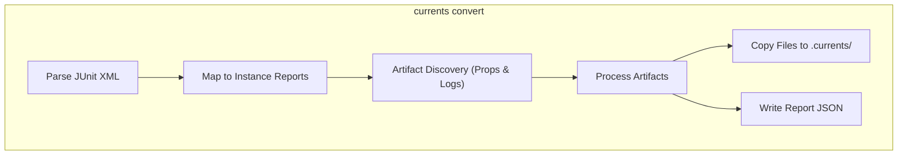

# Convert Command Guide

This document describes the usage and internal workflow of the `convert` command in `@currents/cmd`, which transforms external test reports into the Currents format.

## Usage Guide

The `convert` command is used when a different test runner (like JUnit, Mocha, etc.) generates XML reports. It transforms them into a format understood by Currents. Artifact information can be embedded in two ways.

### Method 1: XML Properties (Structured)

`<property>` tags can be added to the JUnit XML to explicitly define artifacts.

> **Note**: Most standard JUnit reporters do not automatically include custom properties. This method typically requires a custom reporter wrapper or post-processing of the XML.

**Format:** `currents.artifact.{level}.{index}.{key} = {value}`

*   `level`: `attempt` | `test` | `spec`
*   `index`: `0`, `1`, `2`... (Unique index for the artifact)
*   `key`: `path` | `type` | `name`

**Example XML:**

```xml
<testcase classname="auth" name="login">
  <properties>
    <!-- Screenshot for the first attempt -->
    <property name="currents.artifact.attempt.0.path" value="screenshots/login-fail.png" />
    <property name="currents.artifact.attempt.0.type" value="screenshot" />
    
    <!-- Video for the first attempt -->
    <property name="currents.artifact.attempt.0.path" value="videos/login.mp4" />
    <property name="currents.artifact.attempt.0.type" value="video" />
  </properties>
  <failure message="Login failed" />
</testcase>
```

### Method 2: Console Logs (Universal Fallback)

If modifying XML properties is not feasible, a specific marker can be printed to `stdout` during the test. This method is compatible with almost any test runner.

**Marker:** `[[CURRENTS.ATTACHMENT|path/to/file|level]]`

*   **path**: Path to the artifact file.
*   **level** (Optional): `attempt` | `test` | `spec`. Defaults to `attempt`.

The CLI infers the artifact type from the file extension.

**Example Output:**

```text
Starting test...
Error: Element not found
[[CURRENTS.ATTACHMENT|/app/test-results/screenshots/failure.png|attempt]]
[[CURRENTS.ATTACHMENT|/app/test-results/logs/metadata.json|test]]
Test failed.
```

### Running the Command

```bash
npx currents convert --input-file junit-report.xml --output .currents
```

This command parses the XML, finds referenced artifact files, copies them to `.currents/artifacts/`, and generates the report JSON in `.currents/instances/`.

---

## Internal Workflow

The `convert` command transforms external test reports (e.g., JUnit XML) into the Currents format. It supports extracting artifact references from both **XML Properties** and **Console Logs**.

### Flow Diagram



### Workflow Steps

1.  **Parsing**: The command reads JUnit XML files to build the test suite structure.
2.  **Artifact Discovery**:
    *   **Properties**: Scans `<property>` tags for keys like `currents.artifact.{level}.{index}.{key}`.
    *   **Logs**: Scans `<system-out>` for patterns like `[[CURRENTS.ATTACHMENT|path]]`.
3.  **Generation**: The standard `InstanceReport` JSON is created, and referenced files are copied to the `artifacts/` directory.
