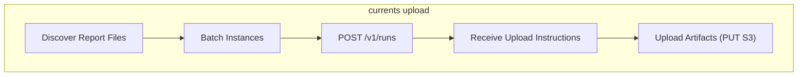

# Upload Command Guide

This document describes the usage and internal workflow of the `upload` command in `@currents/cmd`, which uploads generated reports and artifacts to the Currents dashboard.

## Usage Guide

The `upload` command is used to send the `.currents/` directory (containing test results and artifacts) to the Currents cloud service. This is typically run after tests have completed and reports have been generated.

### Running the Command

```bash
npx currents upload
```

This command discovers the `.currents/` directory and uploads its contents.

---

## Internal Workflow

The `upload` command reads the generated `instances/` and `artifacts/` directories and uploads them. It optimizes uploads by checking for pre-existing artifacts and batching requests.

### Flow Diagram



### Workflow Steps

1.  **Discovery**: The command scans the `.currents/` directory for report files.
2.  **Batching**: Instance reports are grouped into chunks to avoid payload limits.
3.  **Run Creation**: A batch of `InstanceReport`s is sent to the Director service (`POST /v1/runs`). The payload includes test results and artifact metadata (paths, types, sizes).
4.  **Upload Instructions**: The Director service processes the run data and returns `ArtifactUploadInstruction[]` (including presigned S3 URLs) for artifacts that need to be uploaded.
5.  **Artifact Upload**: The command iterates through the instructions, reads the corresponding files from `artifacts/`, and uploads them to the provided URLs.
