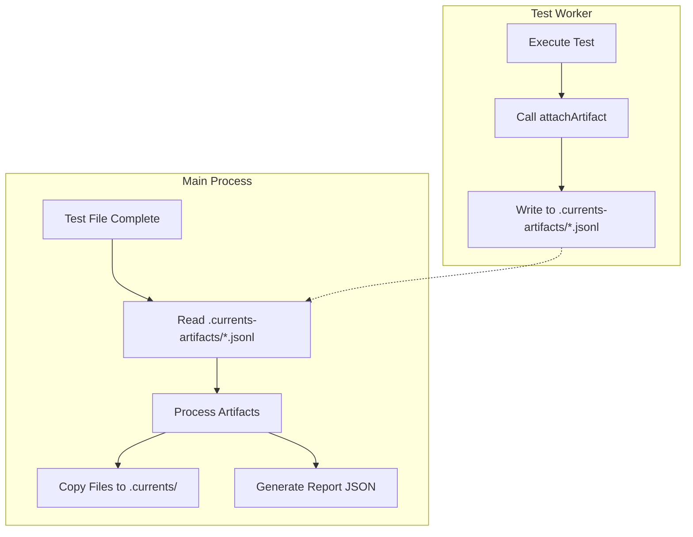

# @currents/jest Reporter Guide

This document provides a comprehensive guide on how to generate and manage artifacts using `@currents/jest`, covering both usage instructions and the internal workflow.

## Usage Guide

The `@currents/jest` reporter enables the attachment of screenshots, videos, and other files directly from Jest tests. These artifacts are uploaded to the Currents dashboard and associated with specific test executions.

### 1. Installation

Install the package as a development dependency:

```bash
npm install @currents/jest --save-dev
```

### 2. Configuration

Add `@currents/jest` to the `jest.config.js` configuration file:

```javascript
// jest.config.js
module.exports = {
  reporters: [
    'default', // Keep the default reporter for console output
    '@currents/jest'
  ],
  // ... other config
};
```

### 3. Attaching Artifacts in Tests

The `attachArtifact` helper (and others) can be used to attach files. Artifacts can be attached at three levels:
*   **Attempt (Default)**: Attached to the specific retry of a test.
*   **Test**: Attached to the test case (visible across all retries).
*   **Spec**: Attached to the test file (suite) itself.

#### Example

```typescript
import { attachArtifact } from '@currents/jest';
import * as path from 'path';

describe('My Feature', () => {
  it('should upload artifacts on failure', async () => {
    try {
      // Test logic...
      await someAction();
    } catch (error) {
      // Take a screenshot
      const screenshotPath = path.resolve(__dirname, 'screenshots/failure.png');
      await takeScreenshot(screenshotPath); // Custom helper
      
      // Attach the screenshot (Attempt Level by default)
      attachArtifact(screenshotPath, 'failure-screenshot.png');
      
      throw error;
    }
  });

  it('should upload test-level metadata', () => {
    // Attach a log file relevant to the whole test case, regardless of retries
    attachArtifact('logs/test-metadata.json', 'metadata', 'test');
  });
});
```

#### Alternative: Console Log Attachments

If importing the `attachArtifact` helper is not preferred, the same console log marker supported by the `convert` command can be used. The reporter automatically detects this pattern in `stdout`.

**Marker:** `[[CURRENTS.ATTACHMENT|path/to/file|level]]`

*   **path**: Absolute or relative path to the artifact file.
*   **level** (Optional): `attempt` | `test` | `spec`. Defaults to `attempt`.
*   **Type:** Inferred from file extension (e.g., `.png` -> screenshot).

```typescript
it('should upload screenshot via log', () => {
  // ... test logic
  const screenshotPath = '/path/to/screenshot.png';
  
  // Default (Attempt Level)
  console.log(`[[CURRENTS.ATTACHMENT|${screenshotPath}]]`);
  
  // Explicit Test Level
  console.log(`[[CURRENTS.ATTACHMENT|${screenshotPath}|test]]`);
});
```

### 4. Running Tests

Tests are executed as usual. Artifacts are collected automatically.

```bash
npm test
```

When `currents upload` runs (or if `currents run` is used), these artifacts are discovered in the `.currents/` directory and uploaded.

---

## Internal Workflow

The Jest reporter hooks into the Jest test execution lifecycle to capture logs and attachments. It utilizes a **file-based communication channel** to reliably transfer artifact metadata from the test execution environment (worker processes) to the main reporter process.

### Flow Diagram



### Workflow Steps

1.  **Artifact Capture (Worker)**: During test execution, `attachArtifact` is called. The helper detects the current test context and writes artifact metadata to a temporary JSONL file in `.currents-artifacts/`.
2.  **Processing (Main)**: When a test file completes, the main reporter process reads the corresponding temporary file.
3.  **File Management**: The reporter processes the artifacts, copies the actual files to the report directory (`.currents/artifacts/`), and links them to the correct test/attempt in the final JSON report (`.currents/instances/`).

### Key Mechanisms

#### Retry Detection
Jest does not expose the current attempt number to the test environment. To support accurate artifact attribution during retries, a heuristic based on `expect.getState().assertionCalls` is used:
*   The number of assertions made in the current test execution is tracked.
*   If `assertionCalls` drops to 0 (or a lower value than previously recorded for the same test), it is inferred that a retry has started.
*   The `getAttempt()` function increments an internal counter to track these resets.

#### Temporary File Storage
Artifacts are written to `.currents-artifacts/` (a hidden directory in the project root) to avoid conflicts with the final report directory `.currents/`.
*   **Format:** JSON Lines (JSONL)
*   **Filename:** Based on a hash of the test file path.
