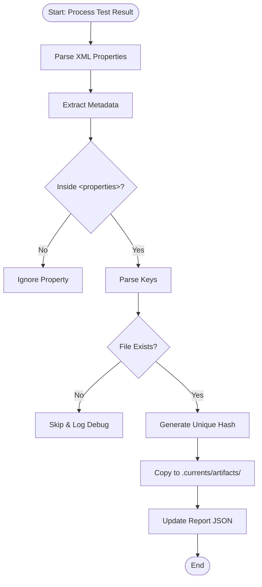

# Artifact Handling in Convert Command

This document describes how the `convert` command processes and extracts artifact information from test reports (JUnit XML) to include in the generated Currents report.

## Artifact Discovery Mechanisms

The command discovers artifacts associated with tests using **XML Properties** within test cases.

> **Important**: All artifact properties **MUST** be enclosed within a `<properties>` tag in your JUnit XML. Properties outside of this tag may not be detected correctly.

### XML Properties (Structured)

The command looks for properties within `<testcase>` or `<testsuite>` elements with keys following specific patterns.

#### 1. Test Level Artifacts

`currents.artifact.test.{property} = {value}`

- **Location**: Inside `<testcase> -> <properties>` element.
- **Properties**: `path`, `type`, `contentType`, `name`.

#### 2. Attempt Level Artifacts

**Indexed Syntax (Recommended for Retries):**
`currents.artifact.attempt.{index}.{property} = {value}`

- **Location**: Inside `<testcase> -> <properties>` element.
- **Behavior**: Assigns the artifact to the specific attempt index (e.g., `attempt.0.path`, `attempt.1.path`).
- **Properties**: `path`, `type`, `contentType`, `name`.

**Unindexed Syntax (Legacy/Single Attempt):**
`currents.artifact.attempt.{property} = {value}`

- **Location**: Inside `<testcase> -> <properties>` element.
- **Behavior**: Assigns the artifact to **Attempt 0**.
- **Properties**: `path`, `type`, `contentType`, `name`.

#### 3. Instance Level Artifacts

`currents.artifact.instance.{property} = {value}`

- **Location**: Inside `<testsuite> -> <properties>` element.
- **Properties**: `path`, `type`, `contentType`, `name`.

**Supported Properties:**

- `path`: Relative or absolute path to the artifact file.
- `type`: The type of artifact (e.g., `screenshot`, `video`, `trace`, `coverage`, `attachment`, `stdout`).
- `contentType`: The MIME type of the file (e.g., `image/png`, `video/mp4`).
- `name`: Optional display name for the artifact.

**Example XML:**

```xml
<testsuite name="auth">
  <properties>
    <!-- Instance level artifact -->
    <property name="currents.artifact.instance.path" value="spec-trace.zip" />
    <property name="currents.artifact.instance.type" value="trace" />
    <property name="currents.artifact.instance.contentType" value="application/zip" />
  </properties>

  <testcase classname="auth" name="login">
    <properties>
      <!-- Test level artifact -->
      <property name="currents.artifact.test.path" value="screenshots/login-fail.png" />
      <property name="currents.artifact.test.type" value="screenshot" />
      <property name="currents.artifact.test.contentType" value="image/png" />

      <!-- Attempt level artifact (Indexed - Attempt 0) -->
      <property name="currents.artifact.attempt.0.path" value="videos/login-attempt-0.mp4" />
      <property name="currents.artifact.attempt.0.type" value="video" />
      <property name="currents.artifact.attempt.0.contentType" value="video/mp4" />

      <!-- Attempt level artifact (Indexed - Attempt 1) -->
      <property name="currents.artifact.attempt.1.path" value="videos/login-attempt-1.mp4" />
      <property name="currents.artifact.attempt.1.type" value="video" />
      <property name="currents.artifact.attempt.1.contentType" value="video/mp4" />
    </properties>
    <failure message="Login failed" />
  </testcase>
</testsuite>
```

## Artifact Processing Workflow

When artifacts are discovered, the `convert` command performs the following steps:



1.  **Discovery**: Parses XML properties within `<properties>` tags to identify potential artifacts.
2.  **Validation**: Verifies that the referenced file exists at the specified path and is within the workspace.
3.  **Copying**: Copies the valid artifact files to the `.currents/artifacts/` directory with a hashed filename (e.g., `abc1234.png`) to prevent collisions.
4.  **Reference**: Updates the generated report JSON to include the artifact metadata (path, type, contentType) linked to the corresponding test result or attempt.

**Note:** Artifacts with paths outside the workspace or that do not exist are skipped with a debug log.
