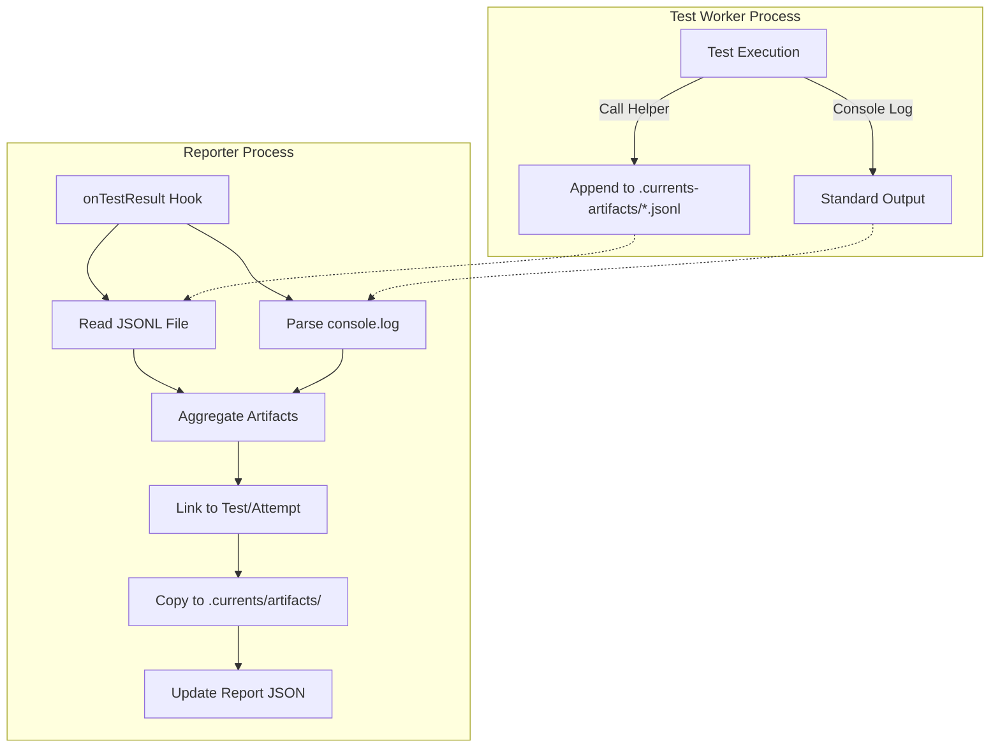

# Artifact Handling in Jest Reporter

This document details the internal mechanisms used by the `@currents/jest` reporter to capture, transport, and associate artifacts with test results.

## Overview

Jest runs tests in parallel worker processes, while the reporter runs in the main process. This architecture requires a robust mechanism to transport artifact metadata from workers to the reporter.

The reporter uses a **file-based communication channel** for explicit attachments and **stdout parsing** as a fallback.

## Artifact Capture Mechanisms

### 1. Explicit Attachment (`attachArtifact`)

The `attachArtifact` helper (and its derivatives `attachScreenshot`, `attachVideo`) writes artifact metadata to a temporary file.

*   **Storage**: `.currents-artifacts/` (hidden directory in project root).
*   **Filename**: `MD5(testFilePath).jsonl` - A unique file per test suite.
*   **Format**: JSON Lines. Each line contains a JSON object with:
    *   `testPath`: Absolute path to the test file.
    *   `currentTestName`: Name of the current test case.
    *   `artifact`: Object containing `path`, `type`, `level`, etc.

This method allows for rich metadata and reliable association with the specific test case and attempt.

### 2. Console Output Parsing (Fallback)

The reporter also parses `console.log` output captured by Jest. It looks for the marker:

`[[CURRENTS.ATTACHMENT|path|level]]`

This is useful for integrations where importing the helper is not feasible. The reporter extracts these markers from the `testResult.console` property exposed by Jest.

## Processing Workflow

### 1. Aggregation

When a test suite completes (`onTestResult`), the reporter:
1.  **Reads**: The corresponding `.jsonl` file from `.currents-artifacts/`.
2.  **Parses**: The `testResult.console` array for attachment markers.
3.  **Merges**: Combines artifacts from both sources.

### 2. Association & Leveling

Artifacts are associated with the correct level based on the `level` property:

*   **Spec Level**: Associated with the file itself.
*   **Test Level**: Associated with a test case (across all retries).
*   **Attempt Level**: Associated with a specific retry of a test case.

### 3. File Management

Valid artifacts are copied to the final report directory:
*   **Source**: Original path provided in the attachment.
*   **Destination**: `.currents/artifacts/<hash>-<filename>`.
*   **Reference**: The `InstanceReport` JSON is updated with the relative path to the copied file.

## Retry Detection

Jest does not natively expose the current attempt number to the test environment (worker). To correctly attribute artifacts to specific retries (attempts), the reporter uses a heuristic in `getAttempt()`:

1.  **Symbol Lookup**: Tries to access internal Jest state via `Symbol(JEST_STATE_SYMBOL)` (if available).
2.  **Assertion Counting**: Falls back to tracking `expect.getState()`. It maintains a map of `testName -> attemptCount`.
    *   If a test is seen again within the same worker context, the attempt count is incremented.
    *   This state is maintained in the worker process memory.
